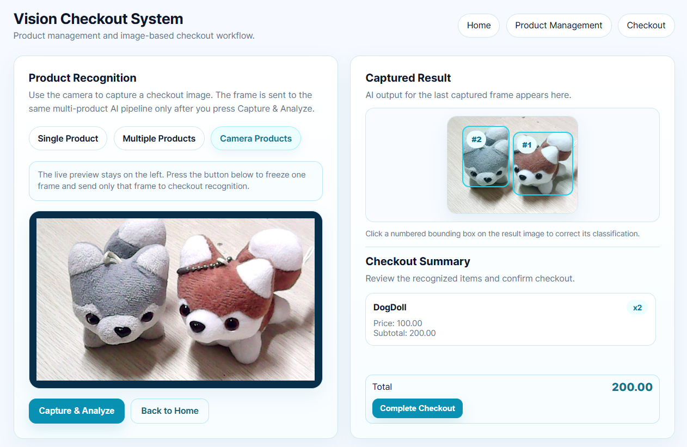
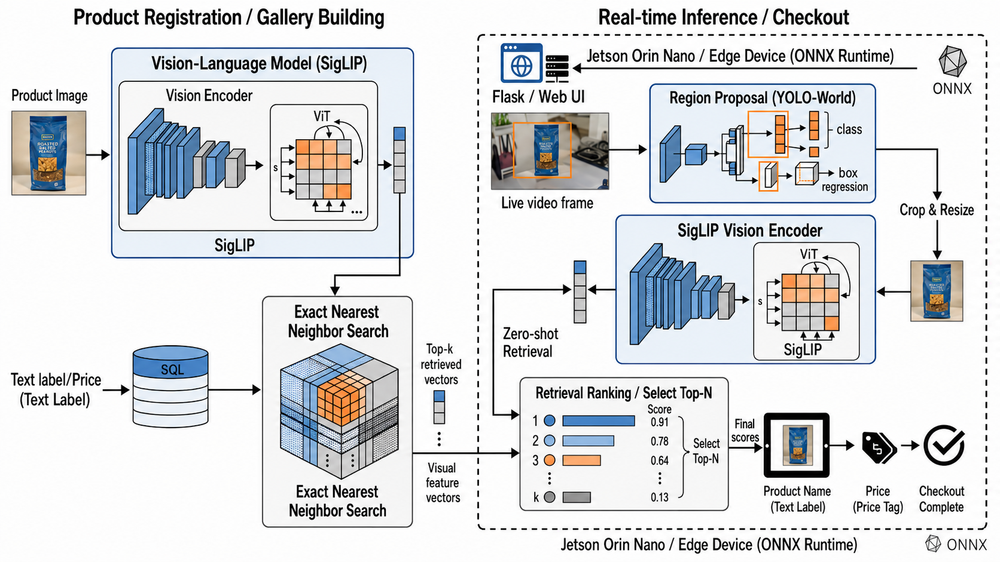
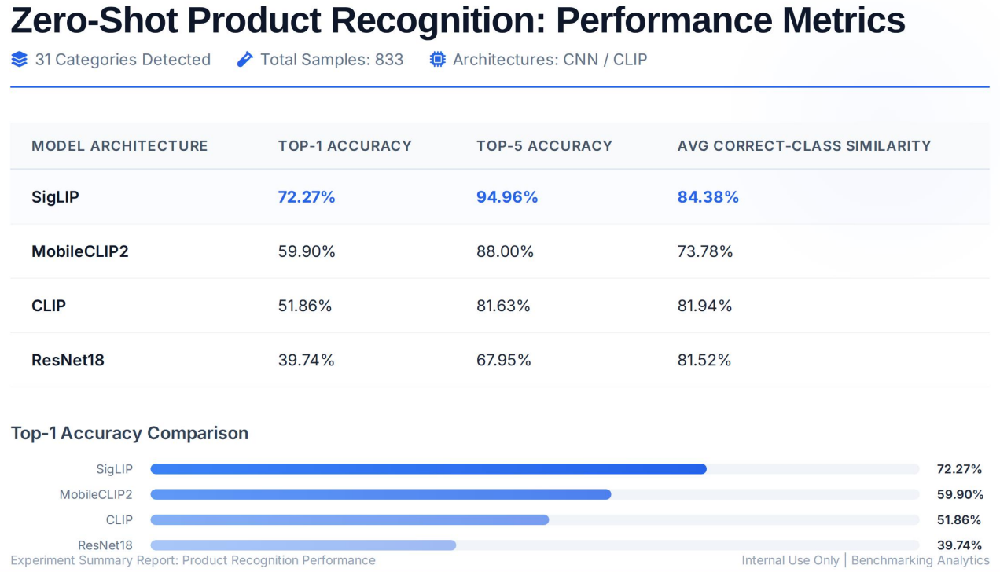

# OczyEdge

### Zero-Shot Product Recognition for Edge Retail

**Low-cost, training-free product recognition for smart retail using lightweight vision-language retrieval.**

 

---

## Overview

**OczyEdge** is a lightweight vision-language retrieval framework designed for **zero-shot product recognition in edge retail environments**.

Instead of training a new classifier whenever products change, OczyEdge allows store owners to register products by uploading only a small number of reference images and metadata. The system encodes product images into embeddings, retrieves visually and semantically similar products, and supports smart checkout workflows on resource-constrained edge devices.

  

---

## Why OczyEdge?

Traditional product recognition systems often require:

- Large labeled datasets
- Supervised model training
- Expensive hardware
- Complex deployment
- Frequent retraining when products change

OczyEdge focuses on a more practical retail scenario:

> **Can small retailers build a usable smart checkout system without collecting large datasets or retraining models?**

---

## Key Features

<table>
  <tr>
    <td><b>Training-Free Product Registration</b></td>
    <td>Register new products using reference images, names, and prices without retraining the model.</td>
  </tr>
  <tr>
    <td><b>Vision-Language Retrieval</b></td>
    <td>Use lightweight VLM embeddings to match product images through semantic similarity search.</td>
  </tr>
  <tr>
    <td><b>Edge-Ready Deployment</b></td>
    <td>Designed for low-cost edge devices such as Raspberry Pi and compact retail terminals.</td>
  </tr>
  <tr>
    <td><b>Smart Checkout Workflow</b></td>
    <td>Detect products, retrieve candidates, display product information, and assist checkout confirmation.</td>
  </tr>
  <tr>
    <td><b>Re-ranking Support</b></td>
    <td>Improve recognition accuracy by re-ranking top-k retrieval candidates with a lightweight matching model.</td>
  </tr>
</table>

---

## System Pipeline

 

  

## System Analysis

  

## Project Document

📄 **Software Project Specification Document**

